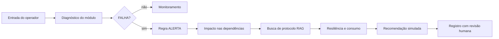

# 🧠 NCAS — Núcleo Cognitivo da Aurora Siger

[](https://www.python.org/)


**Atividade Integradora · Fase 5 · Ciência da Computação · FIAP · 2026**

## 👨‍🚀 Equipe

- [**Matheus Fuchelberguer · RM571321**](https://www.linkedin.com/in/matheus-fuchelberguer-neves/)
- [**Carlos Eugenio Andrade · RM570285**](https://www.linkedin.com/in/carloseugenioandrade/)
- [**Rodrigo Gomes Dias · RM569142**](https://www.linkedin.com/in/rodrigogmdias/)

> Os links direcionam para os perfis profissionais dos integrantes no LinkedIn.

## 🧭 O que é o NCAS

O Núcleo Cognitivo da Aurora Siger (NCAS) é um sistema acadêmico de apoio à tomada de decisão em uma colônia marciana. A aplicação combina manipulação de arquivos texto, dados estruturados em JSON, regras de álgebra booleana e simulação de inteligência artificial generativa em um terminal interativo.

O sistema transforma um evento operacional em uma sequência de decisão:

```text
Infraestrutura → Diagnóstico → Regra booleana → Impacto → Recomendação → Registro
```

## 🚀 O problema que o NCAS resolve

Em uma colônia isolada, uma falha em um módulo pode comprometer serviços essenciais. O operador precisa registrar o evento, identificar sua gravidade, compreender quais módulos dependem do componente afetado e receber uma recomendação inicial.

O NCAS responde a esse problema com uma camada cognitiva simples, auditável e reproduzível:

- registra eventos em arquivo texto;
- organiza informações em JSON;
- identifica módulos críticos por prioridade;
- calcula o impacto direto e transitivo de uma falha;
- aplica uma regra lógica explícita;
- simula diferentes estratégias de prompting;
- mantém todas as operações locais e sem dependências externas.

### Um turno de operação

O operador pode começar registrando uma ocorrência manualmente ou selecionando um módulo da infraestrutura. No diagnóstico, o NCAS combina o status do módulo, sua prioridade e uma eventual falha simulada. Esses dados alimentam a regra de alerta e, em seguida, a análise de dependências mostra quais áreas podem ser afetadas.

O resultado não é apenas um valor booleano. O sistema exibe o contexto da decisão, gera uma recomendação simulada e registra o evento para consulta posterior. Assim, uma ocorrência deixa de ser uma mensagem isolada no terminal e passa a fazer parte de um histórico estruturado.

### Do evento ao histórico

Cada registro nasce com identificador, data, categoria, descrição, indicação de falha e classificação crítica. Ele é gravado no arquivo texto para leitura humana e exportado para JSON para uso estruturado. O JSON também reúne um resumo da infraestrutura, permitindo observar os eventos junto dos módulos e do consumo nominal da colônia.

## 🛸 Pipeline do sistema

1. **Entrada** — o operador cadastra um evento ou escolhe um módulo da infraestrutura.
2. **Persistência** — o evento é gravado em `registros_colonia.txt`.
3. **Estruturação** — os registros e o resumo da rede são exportados para `dados_colonia.json`.
4. **Análise lógica** — `FALHA` e `CRITICO` são avaliados pela regra booleana.
5. **Análise de impacto** — as dependências do módulo são percorridas de forma transitiva.
6. **Recuperação de contexto** — protocolos relacionados são buscados na base local, simulando a etapa retriever de um RAG.
7. **Resiliência** — o sistema estima o consumo comprometido e sugere ações preventivas e de recuperação.
8. **Resposta cognitiva** — o sistema gera uma recomendação contextual simulada.
9. **Auditoria** — a tabela-verdade, os registros e os testes permitem verificar o comportamento.



## 🛰 Arquitetura

O projeto foi dividido por responsabilidade:

| Camada | Arquivo | Responsabilidade |
|---|---|---|
| Entrada | `ncas.py` | Inicia a aplicação |
| Aplicação | `ncas_core/aplicacao.py` | Menu e fluxos do operador |
| Modelos | `ncas_core/modelos.py` | Dataclasses e estados |
| Infraestrutura | `ncas_core/infraestrutura.py` | Módulos, dependências e impacto |
| Conhecimento | `ncas_core/conhecimento.py` | Recuperação de protocolos locais (RAG) |
| Resiliência | `ncas_core/resiliencia.py` | Consumo comprometido e recuperação |
| Lógica | `ncas_core/logica.py` | Regra, simplificação e tabela-verdade |
| Persistência | `ncas_core/repositorio.py` | TXT, JSON e validações |
| IA simulada | `ncas_core/prompts.py` | Zero-shot, few-shot e JSON |
| Dados | `ncas_core/base_conhecimento.json` | Protocolos operacionais locais |
| Qualidade | `test_ncas.py` | Testes automatizados |

Princípios utilizados:

- **Separação de responsabilidades:** cada módulo possui uma finalidade clara.
- **Biblioteca padrão:** não há necessidade de instalar frameworks ou bibliotecas de IA.
- **Determinismo:** a infraestrutura local é criada sempre com os mesmos dados.
- **Validação:** entradas inválidas não devem corromper o estado já carregado.
- **Auditabilidade:** decisões podem ser explicadas pela regra e pela tabela-verdade.
- **Contexto recuperável:** recomendações consultam protocolos locais antes de responder.

## 🌌 Infraestrutura da colônia

A infraestrutura didática possui 10 módulos e consumo nominal total de **1.030 kW**:

| ID | Módulo | Prioridade | Consumo |
|---|---|---:|---:|
| CTL | Centro de Controle | P1 | 15 kW |
| PWR | Complexo de Energia | P1 | 27 kW |
| LSS | Sistema de Suporte de Vida | P1 | 505 kW |
| HAB | Complexo Habitacional | P2 | 85 kW |
| MED | Complexo Médico | P2 | 106 kW |
| COM | Sistema de Comunicação | P3 | 45 kW |
| AGR | Complexo de Agricultura | P3 | 63 kW |
| LOG | Complexo de Logística | P4 | 50 kW |
| MIN | Complexo de Mineração | P4 | 93 kW |
| RES | Centro de Pesquisa | P5 | 41 kW |

### Dependências operacionais

```text
PWR → LSS → HAB
PWR → LSS → MED
PWR → COM → LOG
PWR → COM → MIN
PWR → COM → RES
PWR → LSS → AGR
```

As setas representam uma dependência operacional. Se `PWR` falhar, o NCAS identifica os módulos que podem ser afetados direta ou indiretamente.

## 🔐 Regra de decisão

A regra implementada é:

```text
ALERTA = (FALHA AND CRITICO) OR (FALHA AND NOT CRITICO)
```

Aplicando a distributividade:

```text
ALERTA = FALHA AND (CRITICO OR NOT CRITICO)
ALERTA = FALHA AND VERDADEIRO
ALERTA = FALHA
```

A confirmação com o teorema de De Morgan é:

```text
VERDADEIRO = NOT(CRITICO AND NOT CRITICO)
VERDADEIRO = NOT CRITICO OR CRITICO
```

Portanto, nesta regra didática, qualquer falha gera um alerta, independentemente do valor de `CRITICO`. A prioridade continua sendo usada para classificar e recomendar a resposta operacional.

Para a operação, o NCAS também calcula uma segunda condição:

```text
EMERGENCIA = FALHA AND CRITICO
```

Assim, toda falha gera `ALERTA`, mas somente uma falha em módulo crítico ativa `EMERGENCIA` e o protocolo de contingência imediata.

### Tabela-verdade

| FALHA | CRITICO | ALERTA |
|:---:|:---:|:---:|
| FALSO | FALSO | FALSO |
| FALSO | VERDADEIRO | FALSO |
| VERDADEIRO | FALSO | VERDADEIRO |
| VERDADEIRO | VERDADEIRO | VERDADEIRO |

## 🤖 Simulação de IA generativa

O NCAS não realiza chamadas para APIs externas. As respostas são simuladas para demonstrar técnicas de prompting de maneira reproduzível.

### Zero-shot

Recebe apenas a pergunta, sem exemplos anteriores:

```text
Pergunta: Qual o risco atual da colônia?
Resposta simulada: analisar sensores, registros e nível de risco.
```

### Few-shot

Recebe exemplos antes de responder:

```text
Exemplo: temperatura alta → recomendar resfriamento.
Exemplo: comunicação interrompida → recomendar diagnóstico.
Pergunta: radiação acima do limite → ?
```

### Saída estruturada

A resposta simulada segue um contrato JSON:

```json
{
    "classificacao": "ATENCAO",
    "confianca": 0.92,
    "acao_recomendada": "Verificar o modulo de comunicacao",
    "origem": "simulacao_NCAS"
}
```

Além disso, o diagnóstico de infraestrutura gera uma recomendação contextual com módulo, prioridade, status e impacto previsto.

### RAG local e resiliência

Antes de montar a recomendação, o NCAS busca protocolos relacionados em `base_conhecimento.json` por meio de palavras-chave. Esse fluxo representa, de forma simples e local, a etapa de recuperação de contexto de um sistema RAG.

O módulo de resiliência combina o impacto da falha com o consumo nominal dos módulos afetados. Para componentes P1, recomenda contingência imediata; para impactos menores, sugere isolamento, manutenção e acompanhamento. O resultado é um apoio contextual, não uma decisão automática.

## ⚖️ Ética e uso responsável

O NCAS é um apoio à decisão, não um substituto para a responsabilidade humana. As recomendações são simuladas, devem ser revisadas por um operador e não podem ser aplicadas automaticamente em situações reais.

O projeto considera como riscos principais:

- respostas incorretas ou alucinações de modelos de linguagem;
- vieses nos dados e nas regras de decisão;
- excesso de confiança em uma saída automatizada;
- ausência de contexto ou dados desatualizados;
- decisões que afetem pessoas sem supervisão e possibilidade de revisão.

Por isso, o sistema identifica a origem simulada da resposta, apresenta os dados usados no diagnóstico, mantém a regra booleana explícita e grava `revisao_humana` como `PENDENTE`. A decisão final permanece com o operador.

## 💾 Persistência de dados

### Arquivo texto

`registros_colonia.txt` armazena cada evento em formato delimitado. O sistema usa o módulo `csv`, aceita o caractere `|` dentro dos campos e ignora linhas inválidas com aviso.

### Arquivo JSON

`dados_colonia.json` armazena:

- identificação do sistema;
- data de atualização;
- quantidade de registros;
- registros estruturados;
- total de módulos e módulos ativos;
- módulos críticos;
- consumo nominal;
- quantidade de dependências.
- módulo diagnosticado, impacto previsto, recomendação simulada e status de revisão humana.

A gravação utiliza arquivo temporário e substituição atômica, reduzindo o risco de deixar um JSON incompleto caso ocorra uma falha durante a escrita.

## 🧪 Testes

A suíte utiliza `unittest`, disponível na biblioteca padrão do Python. São **39 testes automatizados** cobrindo:

- regra booleana e tabela-verdade;
- explicação de De Morgan;
- construção e resumo da infraestrutura;
- impacto transitivo de falhas;
- geração de identificadores;
- persistência de múltiplos registros;
- descrições com caracteres especiais;
- arquivos TXT inexistentes ou inválidos;
- JSON inexistente, inválido ou malformado;
- validação de campos e tipos;
- preservação dos dados após erro de leitura;
- prompts zero-shot, few-shot e JSON;
- recuperação de protocolos, tolerância a acentos e recomendações contextuais;
- resiliência, consumo comprometido e encerramento seguro do menu;
- diagnóstico crítico integrado.

Executar os testes:

```bash
py -m unittest discover -v
```

Gerar relatório opcional de cobertura:

```bash
py -m pip install coverage
py -m coverage run -m unittest discover
py -m coverage report
```

## 🚀 Como executar

### Requisitos

- Python 3.10 ou superior;
- nenhum pacote externo obrigatório;
- Windows, Linux ou macOS.

### Execução

```bash
py ncas.py
```

### Menu

```text
1. Cadastrar registro
2. Consultar registros
3. Carregar dados JSON
4. Aplicar regra lógica
5. Exibir prompts simulados
6. Diagnosticar infraestrutura
7. Consultar base de conhecimento (RAG)
8. Exibir painel operacional
9. Alterar status de módulo
10. Executar cenário de demonstração
11. Revisar decisão humana
0. Sair
```

### Roteiro para demonstração

1. Execute `py ncas.py`.
2. Escolha a opção `6`.
3. Informe o módulo `LSS`.
4. Confirme a falha simulada com `s`.
5. Observe `FALHA=True`, `CRITICO=True` e `ALERTA=True`.
6. Observe o impacto e a recomendação contextual.
7. Observe o protocolo recuperado e o nível de resiliência.
8. Escolha a opção `2` para consultar o registro criado.
9. Escolha a opção `3` para visualizar o JSON estruturado.
10. Escolha a opção `4` para apresentar a simplificação e a tabela-verdade.
11. Escolha a opção `7` e pesquise `comunicação` para demonstrar o RAG local.
12. Use a opção `8` para visualizar o painel operacional.
13. Use a opção `10` para testar outros cenários de falha.
14. Use a opção `11` para aprovar ou rejeitar uma recomendação.

## 📁 Estrutura do repositório

```text
aurora-siger-ncas/
├── ncas.py
├── README.md
├── test_ncas.py
└── ncas_core/
    ├── __init__.py
    ├── aplicacao.py
    ├── base_conhecimento.json
    ├── conhecimento.py
    ├── infraestrutura.py
    ├── logica.py
    ├── modelos.py
    ├── prompts.py
    ├── repositorio.py
    └── resiliencia.py
```

Os arquivos `registros_colonia.txt` e `dados_colonia.json` são criados automaticamente após a primeira operação de gravação.

O histórico JSON mantém também o módulo analisado, o impacto previsto, a recomendação simulada e o estado `PENDENTE`, `APROVADA` ou `REJEITADA` da revisão humana.

## ✅ Capacidades do sistema

| Capacidade | Como funciona no NCAS |
|---|---|
| Manipulação de texto | Gravação, leitura, validação e consulta de `registros_colonia.txt` |
| Manipulação de JSON | Criação, leitura, validação e resumo em `dados_colonia.json` |
| Álgebra booleana | Regra de alerta, simplificação e tabela-verdade |
| De Morgan | Demonstração textual do teorema aplicado |
| Zero-shot | Pergunta sem exemplos e resposta simulada |
| Few-shot | Exemplos de entrada e saída antes da pergunta |
| JSON estruturado | Resposta simulada com contrato JSON |
| Menu interativo | Onze operações e encerramento seguro |
| Boas práticas | Modularização, dataclasses, validação e testes |
| Robustez | Tratamento de arquivos inválidos e gravação atômica |
| RAG e resiliência | Busca de protocolos locais, impacto e consumo comprometido |
| Operação | Painel, cenários prontos, alteração de status e revisão humana |

## ⚠️ Limitações do protótipo

O NCAS é uma simulação educacional. Os módulos, consumos, prioridades e dependências são dados didáticos. A IA generativa é simulada localmente e não representa uma inferência feita por um modelo de linguagem real.

## 🔭 Continuidade temática

O projeto utiliza a Aurora Siger como universo compartilhado entre as fases acadêmicas.

