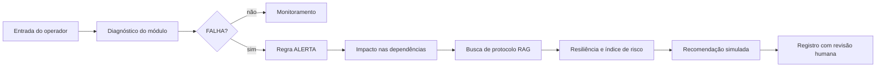

# 🧠 NCAS — Núcleo Cognitivo da Aurora Siger

[](https://www.python.org/)


**Atividade Integradora · Fase 5 · Ciência da Computação · FIAP · 2026**

## 👨‍🚀 Equipe

- [**Matheus Fuchelberguer · RM571321**](https://www.linkedin.com/in/matheus-fuchelberguer-neves/)
- [**Carlos Eugenio Andrade · RM570285**](https://www.linkedin.com/in/carloseugenioandrade/)
- [**Rodrigo Gomes Dias · RM569142**](https://www.linkedin.com/in/rodrigogmdias/)

> Os links direcionam para os perfis profissionais dos integrantes no LinkedIn.

## 🧭 O que é o NCAS

O Núcleo Cognitivo da Aurora Siger (NCAS) é um sistema acadêmico de apoio à tomada de decisão em uma colônia marciana. A aplicação combina manipulação de arquivos texto, dados estruturados em JSON, regras de álgebra booleana e simulação de inteligência artificial generativa em um terminal interativo.

O sistema transforma um evento operacional em uma sequência de decisão:

```text
Infraestrutura → Diagnóstico → Regra booleana → Impacto → Risco → Recomendação → Registro
```

## 🚀 O problema que o NCAS resolve

Em uma colônia isolada, uma falha em um módulo pode comprometer serviços essenciais. O operador precisa registrar o evento, identificar sua gravidade, compreender quais módulos dependem do componente afetado e receber uma recomendação inicial.

O NCAS responde a esse problema com uma camada cognitiva simples, auditável e reproduzível:

- registra eventos em arquivo texto;
- organiza informações em JSON;
- identifica módulos críticos por prioridade;
- calcula o impacto direto e transitivo de uma falha;
- aplica duas regras lógicas explícitas e simplificadas;
- estima um índice de risco com um modelo ajustado por gradiente descendente;
- simula diferentes estratégias de prompting;
- mantém todas as operações locais e sem dependências externas.

### Um turno de operação

O operador pode começar registrando uma ocorrência manualmente ou selecionando um módulo da infraestrutura. No diagnóstico, o NCAS combina o status do módulo, sua prioridade e uma eventual falha simulada. Esses dados alimentam a regra de alerta e, em seguida, a análise de dependências mostra quais áreas podem ser afetadas.

O resultado não é apenas um valor booleano. O sistema exibe o contexto da decisão, gera uma recomendação simulada e registra o evento para consulta posterior. Assim, uma ocorrência deixa de ser uma mensagem isolada no terminal e passa a fazer parte de um histórico estruturado.

## 🛸 Pipeline do sistema

1. **Entrada** — o operador cadastra um evento ou escolhe um módulo da infraestrutura.
2. **Persistência** — o evento é gravado em `registros_colonia.txt`.
3. **Estruturação** — os registros e o resumo da rede são exportados para `dados_colonia.json`.
4. **Análise lógica** — `FALHA` e `CRITICO` são avaliados pela regra booleana.
5. **Análise de impacto** — as dependências do módulo são percorridas de forma transitiva.
6. **Recuperação de contexto** — protocolos relacionados são buscados na base local, simulando a etapa *retriever* de um RAG.
7. **Resiliência e risco** — o sistema estima o consumo comprometido e o índice de risco.
8. **Resposta cognitiva** — o sistema gera uma recomendação contextual simulada.
9. **Auditoria** — a tabela-verdade, os registros e os testes permitem verificar o comportamento.



## 🛰 Arquitetura

O projeto foi dividido por responsabilidade:

| Camada | Arquivo | Responsabilidade |
|---|---|---|
| Entrada | `codigo_fonte.py` | Inicia a aplicação |
| Aplicação | `ncas_core/aplicacao.py` | Menu e fluxos do operador |
| Modelos | `ncas_core/modelos.py` | Dataclasses e estados |
| Infraestrutura | `ncas_core/infraestrutura.py` | Módulos, dependências e impacto |
| Conhecimento | `ncas_core/conhecimento.py` | Recuperação de protocolos locais (RAG) |
| Resiliência | `ncas_core/resiliencia.py` | Consumo comprometido e recuperação |
| Lógica | `ncas_core/logica.py` | Regras, simplificação e tabelas-verdade |
| Otimização | `ncas_core/otimizacao.py` | MSE, gradiente descendente e regularização |
| Persistência | `ncas_core/repositorio.py` | TXT, JSON e validações |
| IA simulada | `ncas_core/prompts.py` | Catálogo de prompts e respostas simuladas |
| Dados | `ncas_core/prompts.json` | Prompts estruturados do sistema |
| Dados | `ncas_core/base_conhecimento.json` | Protocolos operacionais locais |
| Qualidade | `test_ncas.py` | Testes automatizados |

Princípios utilizados:

- **Separação de responsabilidades:** cada módulo possui uma finalidade clara.
- **Biblioteca padrão:** não há necessidade de instalar frameworks ou bibliotecas de IA.
- **Determinismo:** a infraestrutura local é criada sempre com os mesmos dados.
- **Validação:** entradas inválidas não devem corromper o estado já carregado.
- **Auditabilidade:** decisões podem ser explicadas pela regra e pela tabela-verdade.
- **Contexto recuperável:** recomendações consultam protocolos locais antes de responder.

## 🌌 Infraestrutura da colônia

A infraestrutura didática possui 10 módulos e consumo nominal total de **1.030 kW**:

| ID | Módulo | Prioridade | Consumo |
|---|---|---:|---:|
| CTL | Centro de Controle | P1 | 15 kW |
| PWR | Complexo de Energia | P1 | 27 kW |
| LSS | Sistema de Suporte de Vida | P1 | 505 kW |
| HAB | Complexo Habitacional | P2 | 85 kW |
| MED | Complexo Médico | P2 | 106 kW |
| COM | Sistema de Comunicação | P3 | 45 kW |
| AGR | Complexo de Agricultura | P3 | 63 kW |
| LOG | Complexo de Logística | P4 | 50 kW |
| MIN | Complexo de Mineração | P4 | 93 kW |
| RES | Centro de Pesquisa | P5 | 41 kW |

### Dependências operacionais

```text
PWR → LSS → HAB
PWR → LSS → MED
PWR → COM → LOG
PWR → COM → MIN
PWR → COM → RES
PWR → LSS → AGR
```

As setas representam uma dependência operacional. Se `PWR` falhar, o NCAS identifica os módulos que podem ser afetados direta ou indiretamente. O `CTL` é modelado com fonte própria e não depende do `PWR`.

## 🗂 Organização dos dados: por que texto e por que JSON

O sistema grava os mesmos eventos em dois arquivos com finalidades diferentes. A escolha não é redundância: cada formato resolve um problema que o outro resolve mal.

### `registros_colonia.txt` — o log operacional

Guarda a linha do tempo da colônia, um evento por linha, em campos separados por `|`:

```text
3|2026-09-03T16:18:00-03:00|Diagnostico de infraestrutura|LSS: DESLIGADO|True|True
```

Foi escolhido o formato texto porque esses dados são:

- **sequenciais** — um evento novo nunca altera os anteriores, então o modo *append* (`"a"`) basta e o arquivo cresce por acréscimo;
- **planos** — seis campos simples, sem aninhamento, que cabem em uma linha;
- **legíveis por humanos** — o operador consegue abrir o arquivo em qualquer editor durante uma emergência, sem depender do sistema estar no ar;
- **tolerantes a falha parcial** — se uma linha for corrompida, o leitor a descarta com aviso e as demais continuam válidas.

### `dados_colonia.json` — a base estruturada

Guarda o estado completo do sistema, incluindo o que não cabe em uma linha de texto:

```json
{
    "sistema": "Nucleo Cognitivo da Aurora Siger (NCAS)",
    "total_registros": 4,
    "registros": [
        {
            "id_registro": 3,
            "modulo_id": "LSS",
            "impacto": ["AGR", "HAB", "LSS", "MED"],
            "falha": true,
            "critico": true,
            "revisao_humana": "APROVADA"
        }
    ],
    "infraestrutura_ncas": { "total_modulos": 10, "consumo_nominal_kw": 1030.0 }
}
```

Foi escolhido o formato JSON porque esses dados são:

- **aninhados** — `impacto` é uma lista e `infraestrutura_ncas` é um objeto; representá-los em texto plano exigiria inventar um segundo separador;
- **tipados** — `falha` é o booleano `true`, não a palavra `"True"`; ao ler o arquivo, `json.load()` devolve o tipo correto sem conversão manual;
- **mapeáveis a dicionários** — a estrutura JSON é praticamente idêntica a um dicionário Python, o que elimina o código de *parsing*;
- **consumíveis por outro programa** — o JSON é o formato de intercâmbio que um painel ou uma API leria.

### Resumo da decisão

| Dado | Arquivo | Motivo |
|---|---|---|
| Id, data, categoria, descrição, falha, crítico | TXT e JSON | Núcleo do evento; cabe em uma linha e também compõe o registro estruturado |
| Módulo diagnosticado e lista de impacto | JSON | `impacto` é uma lista de tamanho variável |
| Recomendação simulada | JSON | Texto longo, com quebras de linha, que romperia o formato de uma linha |
| Estado da revisão humana | JSON | Campo mutável: muda após a gravação, e o log é imutável por natureza |
| Resumo da infraestrutura | JSON | Objeto aninhado, agregado no momento da gravação |
| Prompts estruturados | JSON (`prompts.json`) | Catálogo com listas de exemplos e templates |
| Protocolos operacionais | JSON (`base_conhecimento.json`) | Documentos com listas de palavras-chave |

### Consequência para a carga do sistema

Como o TXT guarda seis campos e o JSON guarda dez, **o JSON é a fonte primária na inicialização**. O texto funciona como plano de recuperação e só é lido se o JSON não existir ou estiver inválido. Se a ordem fosse invertida, os campos exclusivos do JSON — impacto, recomendação e revisão humana — seriam zerados a cada reinício do sistema.

## 🔐 Regras de decisão

O NCAS implementa duas regras booleanas, simplificadas por caminhos diferentes. A demonstração completa está em [`regras_logicas.pdf`](regras_logicas.pdf).

### Regra 1 — Alerta operacional (teoremas de simplificação)

```text
ALERTA = (FALHA · CRITICO) + (FALHA · CRITICO')
```

Aplicando a distributividade do produto sobre a soma (Teorema 16):

```text
ALERTA = FALHA · (CRITICO + CRITICO')
```

Pela complementaridade da soma (Teorema 4), `A + A' = 1`:

```text
ALERTA = FALHA · 1
```

E pela identidade do produto (Teorema 5), `A · 1 = A`:

```text
ALERTA = FALHA
```

**Por que o resultado se mantém:** os dois termos originais cobrem os únicos valores que `CRITICO` pode assumir. Havendo falha, exatamente um dos termos é verdadeiro, e a operação OR exige apenas um. Não havendo falha, ambos os termos são falsos, pois ambos contêm `FALHA` em um AND. A saída depende só de `FALHA`, e `CRITICO` é redundante para o alerta.

| FALHA | CRITICO | (F·C) + (F·C') | FALHA |
|:---:|:---:|:---:|:---:|
| FALSO | FALSO | FALSO | FALSO |
| FALSO | VERDADEIRO | FALSO | FALSO |
| VERDADEIRO | FALSO | VERDADEIRO | VERDADEIRO |
| VERDADEIRO | VERDADEIRO | VERDADEIRO | VERDADEIRO |

`CRITICO` não foi descartado do sistema: ele continua decidindo a segunda condição de operação.

```text
EMERGENCIA = FALHA · CRITICO
```

Toda falha gera `ALERTA`; apenas a falha em módulo essencial ativa `EMERGENCIA` e o protocolo de contingência imediata.

### Regra 2 — Bloqueio de consulta (teorema de De Morgan)

A política de acesso exige duas condições simultâneas:

```text
ACESSO   = AUTORIZADO · ATIVO
BLOQUEIO = (AUTORIZADO · ATIVO)'
```

Pelo primeiro teorema de De Morgan, `(A · B)' = A' + B'`:

```text
BLOQUEIO = AUTORIZADO' + ATIVO'
```

**Por que o resultado se mantém:** a operação AND só é verdadeira quando ambas as entradas são verdadeiras; negá-la equivale a afirmar que ao menos uma delas falhou — exatamente o que a operação OR das negações expressa.

| AUTORIZADO | ATIVO | (A·B)' | A' + B' |
|:---:|:---:|:---:|:---:|
| FALSO | FALSO | VERDADEIRO | VERDADEIRO |
| FALSO | VERDADEIRO | VERDADEIRO | VERDADEIRO |
| VERDADEIRO | FALSO | VERDADEIRO | VERDADEIRO |
| VERDADEIRO | VERDADEIRO | FALSO | FALSO |

Aqui a simplificação não encurta a expressão — ela **muda a forma**, e é isso que interessa. A forma original devolve apenas "bloqueado". A forma de De Morgan expõe os dois termos separadamente, permitindo ao sistema informar a causa: operador não autorizado, módulo inativo, ou ambos.

## 🤖 Simulação de IA generativa

O NCAS não realiza chamadas para APIs externas. As respostas são simuladas para demonstrar técnicas de prompting de maneira reproduzível. O catálogo completo, com a justificativa de cada prompt, está em [`prompts_utilizados.pdf`](prompts_utilizados.pdf).

Os seis prompts ficam em `ncas_core/prompts.json` e seguem os quatro elementos de projeto: **tarefa**, **contexto**, **exemplos** e **formato de saída**.

| Prompt | Técnica | Objetivo |
|---|---|---|
| `resumir_alerta` | zero-shot | Resumir um alerta operacional em uma frase |
| `classificar_solicitacao` | few-shot | Classificar pedidos da tripulação em quatro filas |
| `resposta_centro_controle` | zero-shot | Padronizar o comunicado ao centro de controle |
| `simplificar_registro` | few-shot | Traduzir registro técnico para linguagem simples |
| `diagnostico_estruturado` | structured output | Devolver diagnóstico como JSON válido |
| `cadeia_raciocinio` | chain-of-thought | Priorizar ocorrências expondo o raciocínio |

### Exemplo de saída estruturada

```json
{
    "classificacao": "ATENCAO",
    "confianca": 0.92,
    "acao_recomendada": "Verificar o módulo de comunicação",
    "origem": "simulacao_NCAS"
}
```

### RAG local e resiliência

Antes de montar a recomendação, o NCAS busca protocolos relacionados em `base_conhecimento.json` por meio de palavras-chave. Esse fluxo representa, de forma simples e local, a etapa de recuperação de contexto de um sistema RAG.

O módulo de resiliência combina o impacto da falha com o consumo nominal dos módulos afetados. Para componentes P1, recomenda contingência imediata; para impactos menores, sugere isolamento, manutenção e acompanhamento.

## 📉 Otimização do índice de risco

O NCAS estima um índice de risco de 0 a 1 para cada ocorrência. Os pesos desse índice não foram escolhidos no chute: são ajustados a partir do histórico da colônia com os métodos do capítulo de otimização, implementados em Python puro em `ncas_core/otimizacao.py`.

**Modelo linear:**

```text
risco = w₀ + w₁·prioridade + w₂·módulos_impactados + w₃·consumo
```

**Função de custo — erro quadrático médio (MSE):**

```text
MSE = (1/n) · Σ (y_real − y_previsto)²
```

O erro é elevado ao quadrado para impedir que desvios positivos e negativos se cancelem e para penalizar mais os desvios grandes.

**Algoritmo — gradiente descendente:** a cada época os pesos caminham na direção oposta ao gradiente da função de custo, `w := w − η·∇J(w)`, com taxa de aprendizado `η = 0,2` ao longo de 4.000 épocas.

Resultado sobre as 10 ocorrências do histórico:

| Métrica | Valor |
|---|---|
| MSE inicial (pesos zerados) | 0,412870 |
| MSE final (após o ajuste) | 0,002531 |
| Redução do erro | **99,39 %** |

**Regularização L2 (Ridge):** um termo de penalização proporcional ao quadrado dos coeficientes é somado à função de custo, desencorajando pesos de magnitude elevada e evitando que uma única variável domine a decisão.

| λ | MSE final | Soma dos pesos |
|---:|---:|---:|
| 0,0 | 0,002235 | 0,9893 |
| 0,01 | 0,002531 | 0,9481 |
| 0,1 | 0,011329 | 0,6951 |
| 0,5 | 0,042185 | 0,3161 |
| 1,0 | 0,057525 | 0,1878 |

A tabela mostra o compromisso entre viés e variância: quanto maior o λ, menores os coeficientes e maior o erro no histórico. O valor adotado (λ = 0,01) mantém o erro baixo sem deixar o modelo depender de uma única variável.

> A taxa de aprendizado precisa respeitar a condição de estabilidade `η·(2λ) < 2`. Com `η = 0,5`, o treino diverge para λ = 1,0; por isso o padrão é `η = 0,2`, estável em toda a faixa testada, e o laço interrompe o ajuste caso os pesos deixem de ser finitos.

## 💾 Memória, armazenamento e fluxo de dados

Mesmo trabalhando apenas com Python e arquivos, os dados do NCAS não existem "soltos" no computador. Esta seção relaciona o projeto com a organização física da máquina.

### Do bit ao registro

A menor unidade de informação é o **bit**, que assume apenas dois estados. As variáveis de decisão do NCAS são exatamente isso: `FALHA` e `CRITICO` carregam um bit de informação cada, e é por isso que a álgebra booleana descreve a regra de alerta tão diretamente — a regra opera sobre o mesmo tipo de grandeza que o hardware manipula.

Já um registro completo ocupa muito mais. No estado atual do projeto:

| Arquivo | Tamanho | Observação |
|---|---:|---|
| `registros_colonia.txt` | 382 bytes | 4 eventos, ~89 bytes por linha |
| `dados_colonia.json` | 3.491 bytes | Mesmos eventos, com impacto e recomendação |
| `ncas_core/prompts.json` | 7.489 bytes | Catálogo de 6 prompts |
| `ncas_core/base_conhecimento.json` | 1.162 bytes | 4 protocolos |

Os quatro arquivos somam 12.524 bytes, pouco mais de 12 KB — o equivalente a cerca de três blocos de 4 KB do sistema de arquivos. Todo o estado da colônia cabe em um punhado de blocos de disco, o que evidencia a diferença de escala entre o dado lógico e o meio que o armazena.

### Endereçamento

O sistema não "procura" um dado varrendo a memória: ele especifica um endereço. Com `n` bits de endereçamento é possível distinguir `2ⁿ` posições — daí a convenção de que 1 KB equivale a 2¹⁰ = 1.024 bytes, e não a 1.000.

O mesmo princípio aparece no software do NCAS em outra escala: cada registro tem um `id_registro` único, gerado por `proximo_id()`, e cada módulo tem um identificador de três letras (`LSS`, `PWR`). São endereços lógicos que permitem localizar um item sem percorrer toda a coleção.

### Hierarquia de memória e volatilidade

Do topo para a base da pirâmide, a memória fica mais lenta, mais barata e mais abundante:

```text
Registradores  →  Cache L1/L2/L3  →  RAM  →  SSD / HD
   (na CPU)         (na CPU)      (volátil)  (não volátil)
   mais rápida                               maior capacidade
```

A distinção decisiva para este projeto é a **volatilidade**: memórias voláteis perdem o conteúdo quando deixam de ser alimentadas eletricamente. A lista `self.registros`, que o NCAS mantém em RAM durante a execução, desaparece assim que o programa termina. É exatamente por isso que os arquivos existem — sem eles, todo diagnóstico feito seria perdido ao encerrar o menu.

Essa é a resposta prática à pergunta "gravar ou não gravar?": o NCAS produz um histórico que precisa sobreviver à sessão, logo a gravação é necessária.

### Fluxo de dados em uma gravação

Quando o operador cadastra um registro, o dado atravessa a máquina:

```text
Teclado → módulo de E/S → barramento de E/S → RAM → CPU (registradores, ULA)
                                                ↓
                                        RAM (buffer do arquivo)
                                                ↓
                            barramento → controlador → SSD/HD (não volátil)
```

1. **Entrada.** A tecla pressionada vira um código transmitido por um módulo de E/S até o barramento.
2. **Memória principal.** A string chega à RAM, onde `input()` a entrega ao programa.
3. **Processamento.** A CPU avalia a regra booleana usando registradores e a ULA — as memórias mais rápidas e de menor capacidade da hierarquia.
4. **Escrita.** `writelines()` entrega os bytes ao sistema operacional, que os mantém em um *buffer* em RAM e depois os transfere, pelo barramento, ao controlador do dispositivo de armazenamento.
5. **Leitura posterior.** Na próxima execução, `readlines()` percorre o caminho inverso e traz os dados do meio físico de volta à memória.

### Barramentos e largura de banda

Os componentes se comunicam por **barramentos** — conjuntos de trilhas metálicas coordenadas pelo *chipset*. Computadores atuais separam o barramento de memória do barramento de E/S justamente para ampliar a largura de banda disponível, e uma política de arbitramento decide qual dispositivo usa o barramento quando vários o solicitam ao mesmo tempo.

Para o NCAS isso tem uma consequência concreta: **o acesso ao disco é ordens de grandeza mais lento que o acesso à RAM**. Por isso o sistema não regrava o arquivo inteiro a cada evento — usa o modo *append*, que acrescenta uma única linha ao final.

### Por que a gravação é atômica

Como o sistema operacional mantém a escrita em *buffer* antes de enviá-la ao dispositivo físico, uma interrupção no meio do processo pode deixar um arquivo pela metade. O NCAS trata esse risco na gravação do JSON: o documento é escrito primeiro em um arquivo temporário e só então substitui o arquivo final, em uma operação de renomeação atômica.

```python
with tempfile.NamedTemporaryFile(mode="w", dir=..., delete=False) as arquivo:
    json.dump(documento, arquivo, ensure_ascii=False, indent=4)
Path(temporario).replace(self.arquivo_json)
```

Se houver falha durante a escrita, o arquivo anterior permanece íntegro no disco. É uma decisão de software que só faz sentido quando se entende como o dado transita entre memória e armazenamento.

## ⚖️ Diversidade, ética e responsabilidade no uso da IA

O NCAS decide **quem é atendido primeiro**. Em uma colônia, isso significa alocar equipes e energia escassas entre pessoas. Um sistema com essa função não é neutro, e esta seção examina os riscos concretos do projeto.

### Riscos de respostas enviesadas

O índice de risco do NCAS é treinado sobre `HISTORICO_OCORRENCIAS`, um conjunto de dez ocorrências que **receberam nota de operadores humanos**. O modelo não aprendeu o que é grave: aprendeu o que aquelas pessoas consideraram grave.

Se a equipe que rotulou o histórico tivesse subestimado sistematicamente ocorrências de um setor — por trabalhar longe dele, por não conviver com quem trabalha lá, ou por considerar aquele trabalho menos qualificado — o gradiente descendente ajustaria os pesos para reproduzir esse julgamento. E o faria com aparência de objetividade: o relatório mostraria uma redução de 99 % do erro, porque o modelo estaria acertando exatamente o viés que lhe foi ensinado.

**Um erro de rotulagem produz um modelo ruim, que é fácil de perceber. Um viés de rotulagem produz um modelo consistente, que é difícil de perceber.**

O mesmo vale para a tabela de prioridades: `P1` a `P5` parecem uma classificação técnica, mas dizem quais espaços da colônia importam mais. Ao decidir que o Centro de Pesquisa é `P5` e o Complexo Habitacional é `P2`, a equipe fez uma escolha sobre pessoas, não sobre equipamentos.

### Racismo estrutural e decisões automatizadas

O racismo estrutural não se manifesta como um ato isolado e identificável: é uma discriminação enraizada, reproduzida nos âmbitos político, econômico, cultural e nas relações cotidianas, porque as instituições foram construídas a partir de uma visão de mundo que já a continha.

Sistemas automatizados são um caminho especialmente eficiente para essa reprodução. Uma regra discriminatória escrita por uma pessoa afeta as decisões que ela toma; a mesma regra codificada em um sistema passa a afetar **todas** as decisões, sem exceção, sem variação e sem quem a questione — com o agravante de que a saída de um computador costuma ser lida como imparcial.

A justificativa meritocrática merece atenção específica aqui. Um critério que parece premiar apenas o desempenho individual ignora que os pontos de partida não são iguais, e por isso tende a converter desigualdade herdada em resultado "merecido". O NCAS prioriza por prioridade de módulo e número de dependentes — critérios que parecem puramente técnicos, mas que foram definidos por pessoas e podem ser revistos.

### Importância da diversidade no desenvolvimento

A relação entre diversidade e qualidade técnica é direta: **uma equipe homogênea produz um sistema que enxerga bem o que essa equipe já enxerga e é cega para o resto**.

Nenhuma revisão de código detecta uma variável que ninguém pensou em coletar. Se todos os desenvolvedores do NCAS trabalham no mesmo turno, no mesmo setor e com a mesma formação, a lista de módulos, os pesos do modelo e as categorias de solicitação vão refletir essa experiência única. Equipes diversas ampliam o conjunto de perguntas feitas antes de o código ser escrito — e são as perguntas não feitas que viram falhas invisíveis.

Vale registrar a distinção conceitual: **raça** refere-se ao âmbito biológico, historicamente usado para classificar grupos humanos; **etnia** refere-se ao âmbito cultural, definindo comunidades por afinidades linguísticas e culturais. Diversidade étnica em uma equipe não é uma cota simbólica — é a presença de repertórios culturais distintos no momento em que as decisões de projeto são tomadas.

Ações afirmativas existem justamente para corrigir efeitos acumulados de discriminações passadas, e estão previstas no Estatuto da Igualdade Racial (Lei 12.288/2010). A Declaração Universal dos Direitos Humanos, em seu artigo 2º, estabelece que não deve haver discriminação por raça, cor, gênero, idioma, nacionalidade ou opinião — princípio que se aplica igualmente a decisões tomadas por software.

### Cuidado com linguagem discriminatória

O NCAS gera texto, e texto carrega julgamento. Três decisões de projeto tratam disso:

- **Os prompts descrevem situações, não pessoas.** O prompt `classificar_solicitacao` classifica o *pedido* (`MANUTENCAO`, `SUPRIMENTO`), nunca quem o fez. Nenhum prompt do catálogo recebe nome, cargo ou origem do solicitante, porque esses dados não melhorariam a classificação e abririam espaço para tratamento desigual.
- **Traduzir sem hierarquizar.** O prompt `simplificar_registro` converte jargão técnico em linguagem cotidiana. O contexto informa que o leitor "não conhece os códigos dos módulos" — uma afirmação sobre familiaridade com uma convenção, não sobre capacidade. Linguagem simples é acessibilidade; linguagem simplificada com condescendência é exclusão.
- **Vocabulário do domínio.** Os termos do sistema (`DEGRADADO`, `SOBREVIVENCIA`, `CRITICO`) descrevem estados de equipamento. Aplicados a pessoas, seriam ofensivos — e essa fronteira precisa ser mantida deliberadamente conforme o sistema cresce.

### Impactos sociais das decisões automatizadas

Uma recomendação do NCAS que priorize o módulo errado atrasa o socorro a quem estava no módulo preterido. O dano não é abstrato, e recai sobre quem tem menos condições de contestar a decisão.

Três características do sistema reduzem esse risco:

- **Explicabilidade.** A regra de bloqueio usa a forma de De Morgan justamente para informar *por que* uma consulta foi negada. Um sistema que apenas nega, sem dizer o motivo, é impossível de contestar — e o direito de contestar é o que separa uma decisão de uma imposição.
- **Rastreabilidade.** Todo diagnóstico é gravado com data, módulo, impacto calculado e recomendação. Uma decisão que ninguém consegue reconstruir depois é uma decisão que ninguém consegue corrigir.
- **Origem declarada.** Toda resposta simulada é marcada (`origem: simulacao_NCAS`), para que ninguém a confunda com medição de sensor.

### Responsabilidade humana

A decisão final é sempre de uma pessoa. Isso está no código, não apenas no discurso: todo diagnóstico nasce com `revisao_humana` em `PENDENTE` e só muda para `APROVADA` ou `REJEITADA` quando um operador registra sua decisão no menu 13.

O NCAS **não executa ações**. Ele não desliga módulos, não redireciona energia e não despacha equipes: apenas apresenta uma recomendação. Essa limitação é intencional. Manter a pessoa no circuito impede a difusão da responsabilidade — a situação em que uma decisão prejudicial acontece e ninguém a assumiu, porque "foi o sistema que decidiu".

Vale lembrar que uma resposta de IA generativa bem formatada e confiante pode simplesmente estar errada. Fluência não é evidência. Por isso o sistema exibe os dados que fundamentaram a recomendação — módulo, prioridade, impacto, protocolo recuperado, índice de risco — permitindo que o operador avalie o caminho, e não apenas a conclusão.

### Limites desta análise

O NCAS é um protótipo acadêmico com dados fictícios, e este texto reflete sobre o que ele faria se fosse real. Reconhecer essa distância é parte do exercício: as decisões de projeto descritas acima — revisão humana obrigatória, explicabilidade, rastreabilidade, ausência de dados pessoais — são baratas de implementar agora e caras de acrescentar depois que um sistema já está em operação.

## 💾 Persistência de dados

### Arquivo texto

`registros_colonia.txt` armazena cada evento em formato delimitado. O sistema usa `open()` com o gerenciador de contexto `with` e os métodos `readlines()`, `readline()`, `read()` e `writelines()`. Linhas inválidas são ignoradas com aviso, e o separador `|` é sanitizado nos campos livres para que uma descrição digitada pelo operador nunca quebre o formato.

### Arquivo JSON

`dados_colonia.json` armazena identificação do sistema, data de atualização, quantidade e lista de registros — com módulo diagnosticado, impacto previsto, recomendação simulada e estado da revisão humana — além do resumo da infraestrutura.

A gravação utiliza arquivo temporário e substituição atômica, reduzindo o risco de deixar um JSON incompleto caso ocorra uma falha durante a escrita.

## 🧪 Testes

A suíte utiliza `unittest`, disponível na biblioteca padrão do Python. São **72 testes automatizados** organizados em oito classes:

| Classe | Cobertura |
|---|---|
| `RegraAlertaTests` | Regra original, forma simplificada, emergência e tabela-verdade |
| `RegraBloqueioTests` | De Morgan, equivalência e identificação da causa do bloqueio |
| `InfraestruturaTests` | Rede, resumo, impacto transitivo e cenários |
| `ResilienciaTests` | Níveis de resiliência e consumo comprometido |
| `PersistenciaTests` | TXT, JSON, validações, acentos e regressão da carga inicial |
| `ConhecimentoTests` | Busca de protocolos e tolerância a acentos |
| `PromptsTests` | Catálogo, renderização, contrato JSON e simulador |
| `OtimizacaoTests` | MSE, convergência, regularização e faixas de risco |
| `AplicacaoTests` | Menu, fluxos completos e encerramento seguro |

Executar os testes:

```bash
python3 -m unittest discover -v
```

Gerar relatório opcional de cobertura:

```bash
python3 -m pip install coverage
python3 -m coverage run -m unittest discover
python3 -m coverage report
```

## 🚀 Como executar

### Requisitos

- **Python 3.10 ou superior** — o código usa a sintaxe de união de tipos `X | Y`;
- **nenhum pacote externo** — o `requirements.txt` está vazio de dependências de propósito;
- Windows, Linux ou macOS.

O projeto usa apenas a biblioteca padrão. Instalar a partir do arquivo de requisitos não baixa nada, e existe para tornar essa condição explícita:

```bash
pip install -r requirements.txt
```

### Execução

```bash
python3 codigo_fonte.py
```

### Menu

```text
-- Registros e arquivos --
 1. Cadastrar registro (texto + JSON)
 2. Consultar registros salvos
 3. Carregar dados do arquivo JSON
-- Regras lógicas --
 4. Regra de alerta (teoremas de simplificação)
 5. Regra de acesso (teorema de De Morgan)
-- Inteligência simulada --
 6. Exibir prompts estruturados
 7. Diagnosticar infraestrutura
 8. Consultar base de conhecimento (RAG)
 9. Otimizar índice de risco (MSE)
-- Operação --
10. Exibir painel operacional
11. Alterar status de módulo
12. Executar cenário de demonstração
13. Revisar decisão humana
 0. Sair
```

### Roteiro para demonstração

1. Execute `python3 codigo_fonte.py`.
2. Escolha a opção `7` e informe o módulo `LSS`; confirme a falha com `s`.
3. Observe `FALHA=True`, `CRITICO=True`, `ALERTA=True` e `EMERGENCIA=True`.
4. Observe o impacto (`AGR, HAB, LSS, MED`), o protocolo recuperado e o índice de risco.
5. Escolha a opção `2` para consultar o registro criado no arquivo texto.
6. Escolha a opção `3` para visualizar o JSON estruturado.
7. Escolha a opção `4` para apresentar a simplificação e a tabela-verdade.
8. Escolha a opção `5` com `n` e `s` para demonstrar De Morgan identificando a causa.
9. Escolha a opção `6` e depois `0` para exibir todos os prompts estruturados.
10. Escolha a opção `9` para mostrar a redução do MSE e o efeito da regularização.
11. Use a opção `8` e pesquise `comunicação` para demonstrar o RAG local.
12. Use a opção `10` para visualizar o painel operacional.
13. Use a opção `13` para aprovar ou rejeitar a recomendação registrada.

## 📁 Estrutura do repositório

```text
fiap-fase-5-aurora-siger/
├── codigo_fonte.py              # arquivo principal do sistema
├── dados_colonia.json           # dados estruturados
├── registros_colonia.txt        # log de eventos
├── regras_logicas.pdf           # regra booleana, simplificação e explicação
├── prompts_utilizados.pdf       # prompts criados e explicação de cada um
├── link_video.txt               # link do vídeo de apresentação
├── requirements.txt             # declara ausência de dependências externas
├── README.md
├── test_ncas.py
└── ncas_core/
    ├── __init__.py
    ├── aplicacao.py
    ├── base_conhecimento.json
    ├── conhecimento.py
    ├── infraestrutura.py
    ├── logica.py
    ├── modelos.py
    ├── otimizacao.py
    ├── prompts.json
    ├── prompts.py
    ├── repositorio.py
    └── resiliencia.py
```

## ✅ Capacidades do sistema

| Capacidade | Como funciona no NCAS |
|---|---|
| Manipulação de texto | `open()`, `with`, modos `r`/`a`/`w`, `read`, `readline`, `readlines`, `writelines` |
| Manipulação de JSON | Criação, leitura, validação de tipos e gravação atômica |
| Dicionários | Registros, resumo da rede e catálogo de prompts |
| Álgebra booleana | Duas regras, simplificação e tabelas-verdade |
| Teoremas de simplificação | Distributividade, complementaridade e identidade |
| De Morgan | `(A·B)' = A' + B'` aplicado à regra de acesso |
| Zero-shot | Dois prompts sem exemplos prévios |
| Few-shot | Dois prompts com exemplos de entrada e saída |
| Chain-of-thought | Priorização com raciocínio passo a passo |
| Saída estruturada | Contrato JSON validado por teste |
| Otimização de modelos | MSE, gradiente descendente e regularização L2 |
| Memórias e barramentos | Seção dedicada ao fluxo de dados e à volatilidade |
| Diversidade e ética | Seção dedicada a viés, racismo estrutural e responsabilidade |
| Menu interativo | Treze operações e encerramento seguro |
| Robustez | Tratamento de arquivos inválidos e gravação atômica |

## ⚠️ Limitações do protótipo

O NCAS é uma simulação educacional. Os módulos, consumos, prioridades e dependências são dados didáticos. A IA generativa é simulada localmente e não representa uma inferência feita por um modelo de linguagem real. O modelo de risco é ajustado sobre um histórico fictício de dez ocorrências, tamanho suficiente para demonstrar o método, mas não para sustentar conclusões estatísticas.

## 🔭 Continuidade temática

O projeto utiliza a Aurora Siger como universo compartilhado entre as fases acadêmicas.
